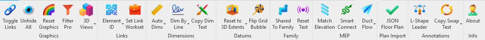

# AJ Tools - Revit Add-in Toolkit

AJ Tools is a Revit 2020 add-in that provides ribbon tools for graphics cleanup, dimensioning, datums, and MEP production workflows.

## Ribbon Preview

## Supported Versions
- Revit 2020 (built and tested)
- .NET Framework 4.7.2
- Windows x64
- For newer Revit versions, update RevitAPI/RevitAPIUI references and rebuild.

## Installation
### Option A (Recommended): Install from GitHub Release zip
1. Download `AJ-Tools-vX.Y.Z.zip` from **GitHub Releases** (not the source-code zip).
2. Extract it.
3. Run `install.cmd` (or `install.ps1`) from the extracted folder.

### Option B: Scripted install from local `dist/`
1. Run `dist/package.ps1` (or build manually and place all required DLLs in `dist/`).
2. Run `dist/install.ps1` (or `dist/install.cmd`) to copy files to both user and all-users add-in folders.
3. Run `dist/uninstall.ps1` (or `dist/uninstall.cmd`) to remove the add-in.

### Option C: Manual install
1. Build a Release DLL.
2. Create `%APPDATA%\Autodesk\Revit\Addins\2020\AJ Tools`.
3. Copy `AJ Tools.dll`, dependency DLLs (for example `Newtonsoft.Json.dll`), and the `Resources` folder into that folder.
4. Copy `Addin/AJ Tools.addin` (or `dist/AJ Tools.addin`) to `%APPDATA%\Autodesk\Revit\Addins\2020`.
5. Open the `.addin` file and make sure `<Assembly>` points to `%APPDATA%\Autodesk\Revit\Addins\2020\AJ Tools\AJ Tools.dll`.
6. For all users, use `%PROGRAMDATA%\Autodesk\Revit\Addins\2020` instead of `%APPDATA%`.

> Note: the repository source-code zip is not a prebuilt installer package. Use a release zip or run `dist/package.ps1` first.

## Build
1. Open `AJ Tools.sln` in Visual Studio 2019 or 2022.
2. Confirm Revit API references point to `C:\Program Files\Autodesk\Revit 2020\RevitAPI.dll` and `C:\Program Files\Autodesk\Revit 2020\RevitAPIUI.dll`.
3. Build x64 Debug or Release.
4. A post-build target deploys to `%PROGRAMDATA%\Autodesk\Revit\Addins\2020\AJ Tools` by default. Set `SkipRevitAddinDeploy=true` to skip deployment.
5. To create a clean release package zip, run:
   - `powershell -ExecutionPolicy Bypass -File .\dist\package.ps1 -Configuration Release`

## GitHub Release and Tag Flow
1. Update assembly version in `src/Properties/AssemblyInfo.cs` (example: `1.2.0.0`).
2. Run `dist/package.ps1` and verify `dist/release/AJ-Tools-vX.Y.Z.zip` was generated.
3. Commit and push your code:
   - `git add .`
   - `git commit -m "Release vX.Y.Z"`
   - `git push origin master`
4. Create and push one annotated tag format only: `vX.Y.Z` (lowercase `v`):
   - `powershell -ExecutionPolicy Bypass -File .\dist\create-tag.ps1 -Version X.Y.Z -Push`
5. On GitHub, create a Release from that tag and upload `AJ-Tools-vX.Y.Z.zip`.
6. Optional one-time cleanup for legacy tag names:
   - `git tag -d V_1.0.0 V_1.1.0`
   - `git push origin :refs/tags/V_1.0.0 :refs/tags/V_1.1.0`

## Tool List (AJ Tools Ribbon)
### Graphics
- Toggle Links - Toggle visibility of Revit links in the active view.
- Unhide All - Clear temporary hide/isolate and unhide hidden elements in the active view.
- Reset Graphics - Clear per-element graphic overrides in the active view.

### Links
- Linked ID of Selection - Inspect Element ID and source for a picked host or linked element.
- View by Linked ID - Search by Element ID across host and loaded links and zoom to the element.

### 3D Views
- 3D Views as per Workset - Create one 3D view per user workset; each view is named by workset and hides other user worksets.

### Dimensions
- Auto Dims - Grids Only, Levels Only, or Grids + Levels.
- Dim By Line - Grid Only or Level Only along a picked line.
- Copy Dim Text - Copy Above/Below/Prefix/Suffix text between dimensions.

### Datums
- Reset to 3D Extents - Grids Only, Levels Only, or Grids + Levels.
- Flip Grid Bubble - Toggle which end of a grid shows the bubble.

### MEP
- Match Elevation - Match middle elevation from a source pipe, duct, cable tray, conduit, flex duct, or flex pipe to targets.
- Duct Flow - Place duct flow annotations and manage settings.
- Filter Pro - Build parameter filters and apply them to the active view.

### Annotations
- L-Shape Leader - Force right-angle tag leaders and flip elbow direction.
- Reset Text - Reset text notes/tags to default offsets.
- Copy Swap Text - Copy or swap text values between text notes.

### Info
- About - Add-in info and contact.

## Notes and Limitations
- Commands run only in non-template project views.
- Auto Dims requires Crop View to be enabled and works only in plan, section, or elevation views.
- Duct Flow supports horizontal ducts only; select an annotation family in Settings first.
- Filter Pro only exposes Revit filterable categories/parameters; large models may limit value scanning.
- View templates or locked view settings can block visibility/override changes.

## Repository Layout
- `src/` contains the add-in source code. See `src/README.md` for the folder map.
- `Addin/` contains the standalone `.addin` manifest template.
- `dist/` contains install scripts and packaging assets.

## Versioning and Changelog
- Assembly version is defined in `src/Properties/AssemblyInfo.cs` (current: 1.2.0.0).
- Git tag format should be `vX.Y.Z` only (example: `v1.2.0`).
- No `CHANGELOG.md` is included yet.

## Credits and Contact
- Developed by Ajmal P.S.
- LinkedIn: https://www.linkedin.com/in/ajmalps/
- Email: ajmalnattika@gmail.com
